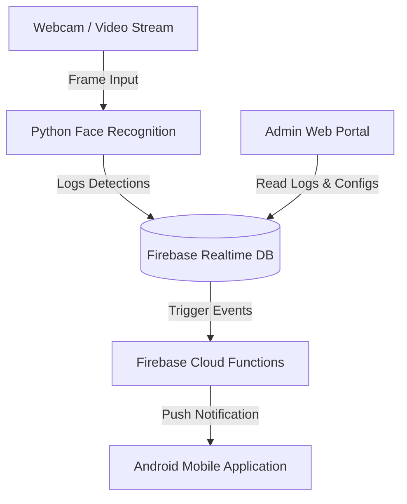

# Capstone Smart Security System

A modern, multi-technology college capstone project integrating **Computer Vision**, a **Web Portal**, an **Android Client**, and **Firebase Cloud Functions** into a cohesive prisoner monitoring and alert system.

---

## 🛠️ Project Architecture



1. **Python Facial Recognition (`facial-recognition/`)**: Monitors camera streams, detects faces via OpenCV, calculates embeddings via `face_recognition`, and updates detection timestamps in the Firebase Realtime Database.
2. **Admin Web Portal (`WebApp/`)**: A modern, glassmorphic dark-theme portal for system administrators to manage employee ID registrations, inspect prisoner location logs, and track room occupancy status.
3. **Android Client (`CapstonePrototype/` & `Application/`)**: Receives push notifications from Firebase and displays emergency flags.
4. **Firebase Functions (`firecast/`)**: Serverless function that triggers when an emergency is logged and alerts the Android client via FCM.

---

## 📁 Repository Structure

*   `WebApp/`: Source HTML, CSS and JS for the web portal.
*   `facial-recognition/`: Python scripts, cascades, and local dataset for face processing.
*   `CapstonePrototype/` / `Application/`: Source directories for the Android applications.
*   `firecast/`: Configurations and code for deploying Firebase Database Rules and Cloud Functions.
*   `Experimental-Codes/`: Archive folders for previous algorithm prototypes and scripts.

---

## 🚀 Getting Started

### 1. Web Portal Setup

The web portal is built using **HTML5**, **Vanilla CSS**, and **ES6 JavaScript Modules**, calling the Firebase Web SDK v10 directly from a CDN.

1.  Open the [firebase-config.js](file:///c:/projects/capstone-project/WebApp/firebase-config.js) file.
2.  Replace the `firebaseConfig` object placeholder credentials with your specific Firebase project credentials.
3.  Launch [loginpract.html](file:///c:/projects/capstone-project/WebApp/loginpract.html) directly in a web browser, or serve it using any simple static HTTP server (e.g. `npx serve WebApp` or Python's `python -m http.server`).

---

### 2. Python Facial Recognition Setup

Dependencies and environments are managed using `uv`. See **[docs/running-scripts.md](./docs/running-scripts.md)** for full details.

#### Quick Start — Project Environment
```bash
cd facial-recognition
uv sync                       # creates .venv and installs everything from pyproject.toml
uv run encode_faces.py --dataset dataset --encodings encodings.pickle --detection-method hog
uv run pi_face_recognition.py --cascade haarcascade_frontalface_default.xml --encodings encodings.pickle
```

#### Quick Start — Inline Script (no setup)
Each script embeds its own dependency list ([PEP 723](https://peps.python.org/pep-0723/)). `uv` auto-installs everything on first run:
```bash
uv run facial-recognition/pi_face_recognition.py --cascade haarcascade_frontalface_default.xml --encodings encodings.pickle
```

#### Configure Credentials
1. Copy [.env.example](./facial-recognition/.env.example) → `.env`
2. Set `FIREBASE_DATABASE_URL` to your Realtime Database URL
3. (Optional) Set `GOOGLE_APPLICATION_CREDENTIALS` to a service account JSON path

---

### 3. Android Client Setup

*   The Android projects have been modernized to use **targetSdkVersion 34** (Android 14) and AndroidX libraries.
*   Make sure you have Android SDK 34 installed.
*   Place your generated `google-services.json` inside the `app/` folder.
*   Build the application using Android Studio.

---

### 4. Firebase Cloud Functions

1.  Navigate to `firecast/functions`.
2.  Install dependencies:
    ```bash
    npm install
    ```
3.  Set your FCM device target token in your environment or substitute the token in [index.js](file:///c:/projects/capstone-project/firecast/functions/index.js).
4.  Deploy your functions and database rules using the Firebase CLI:
    ```bash
    firebase deploy
    ```
